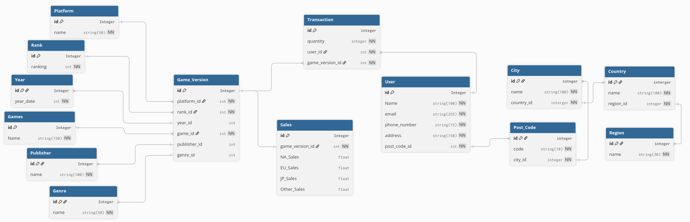

# Conception BDD Normalisée et Conforme au RGPD 

## Objectifs

- Conception bbd suivant methode MERISE 
- Conception bbd utilisant ORM (sqlalchemy)
- Respect des bonnes pratiques RGPD
- BDD repectera normalisation 3NF
- rendu note de conformite

# MCD

# MLD

# MPD
