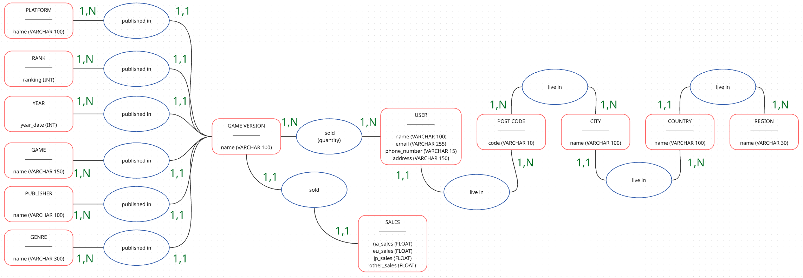
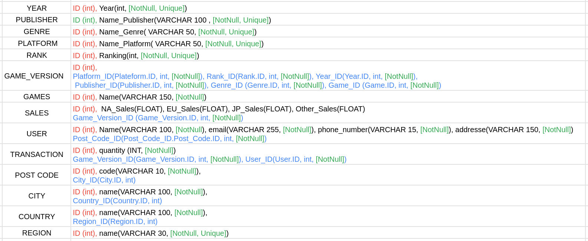

# Conception BDD Normalisée et Conforme au RGPD 

## Objectifs

- Conception bbd suivant methode MERISE 
- Conception bbd utilisant ORM (sqlalchemy)
- Respect des bonnes pratiques RGPD
- BDD repectera normalisation 3NF
- rendu note de conformite

# MCD

# MLD

# MPD

## To Do

- improve reusability
- add documentation
- add catching of errors
- add loggins
- accept rerun of main.ipynb without error
- add test
- develope eda (done not registered)